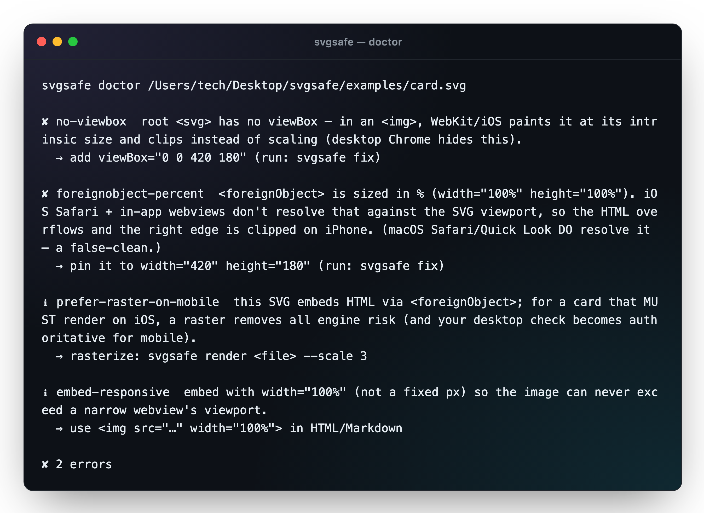
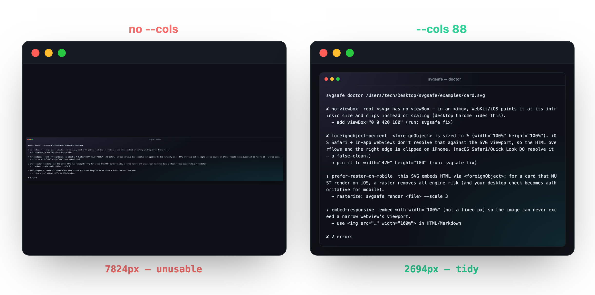

<div align="center">

# 🖼 shotcraft

### Real terminal output → a beautiful, brand-matched PNG for your README

Portfolio screenshots are tedious and never look consistent. shotcraft turns the *actual*
output of your CLI — or a before/after — into a crisp, transparent, on-brand image in one
command, driving the Chrome you already have. **Zero runtime dependencies; never downloads a browser.**

[](https://github.com/convenientlymike/shotcraft/actions/workflows/ci.yml)
&nbsp;[](https://www.npmjs.com/package/shotcraft)
&nbsp;
&nbsp;
&nbsp;
&nbsp;
&nbsp;

</div>

<div align="center">



</div>

---

## ▶️ Try it

- **In your browser (no install):** the [**live playground**](https://convenientlymike.github.io/shotcraft/) styles your pasted terminal output (ANSI colors and all) into the branded card, live.
- **Zero-install CLI:**
  ```bash
  npx github:convenientlymike/shotcraft term --run "your-cli --help" -o shot.png
  ```
- [](https://stackblitz.com/github/convenientlymike/shotcraft)
&nbsp;[](https://codespaces.new/convenientlymike/shotcraft)

> Every screenshot in this README was made by shotcraft. 🐢

## Why

A great README lives on its screenshots — but capturing them is fiddly: real terminals
can't give you brand colors, window chrome, and Retina crispness in a committable PNG, and
hand-built "carbon" images drift from your actual output.

> shotcraft renders the **real** output (you run the command, it captures it) into a
> premium, **brand-matched** image — deterministically, from the CLI or in CI.

## ✨ Features

### 🖥 `term` — real output → a styled terminal
- **Runs your command and captures the truth** — `--run "<cmd>"` (color forced on) or pipe via stdin. The text is real, never mocked.
- **ANSI remapped to the brand ramp** — any colored CLI comes out on-palette automatically (basic-16, xterm-256, truecolor, bold/dim).
- **Tidy by construction** — `--cols` wraps long lines; dimensions are computed from the monospace metrics, so the PNG is tight (no cropping).

### 🔀 `diff` — before/after, framed
- Two images side by side with colored labels + captions and a **`card` · `phone` · `browser`** frame — perfect for "the bug" vs "the fix."

### ⚙ A version-proof renderer
- Drives an **installed** Chrome over the **DevTools Protocol** with an explicit close — not the `--screenshot` CLI, which hangs or won't exit depending on the Chrome version. Hardened against the macOS keychain prompt, background-networking hangs, and temp-cleanup races.
- **Zero runtime dependencies**, transparent output, `--scale` for Retina.

## 📸 A look inside

`diff` framing a real before/after — shotcraft's own `--cols` fix:



## 🚀 Quickstart

| Prerequisite | Notes |
|---|---|
| Node ≥ 22 | built-in `WebSocket` + `fetch` (zero deps) |
| Chrome / Chromium | any installed build; **never downloaded** (set `$SHOTCRAFT_CHROME` to pin) |

```bash
# zero-install
npx github:convenientlymike/shotcraft term --run "npm run lint" --cols 90 -o lint.png
npx github:convenientlymike/shotcraft diff --before old.png --after new.png --frame phone -o diff.png

# or clone + build
pnpm install && pnpm build
node dist/cli.js term --run "git log --oneline -5" --title "recent work" -o log.png
```

## 🏗 Architecture

```
  real output ─┐
   (--run/stdin)│  buildTerm ─┐
                │             ├─▶  themed HTML  ──▶  Chrome (DevTools Protocol) ──▶  PNG
   two images ──┤  buildDiff ─┘   (brand palette,     • launch headless + mock keychain
   (--before/   │                  window chrome,      • Page.navigate (file://, $TMPDIR)
    --after)    │                  ANSI→brand ramp)    • Emulation: DPR + transparent bg
                ┘                                      • Page.captureScreenshot → Browser.close
```

- **`src/ansi.ts`** — zero-dep ANSI parser; remaps the 16 colors onto the theme.
- **`src/theme.ts`** — the brand palette + ANSI mapping.
- **`src/term.ts` / `src/diff.ts`** — build the HTML + compute exact dimensions.
- **`src/render.ts`** — the hardened CDP renderer (drives an installed Chrome; no download).

## 📂 Project layout

```
src/
  cli.ts        # term · diff dispatch
  term.ts       # output → styled terminal HTML (+ precise sizing, --cols wrap)
  diff.ts       # before/after framed HTML (card/phone/browser; images as data URIs)
  ansi.ts       # ANSI SGR → themed HTML spans
  theme.ts      # brand palette + ANSI-16 → brand ramp
  render.ts     # HTML → transparent PNG over the DevTools Protocol
  chrome.ts     # resolve an installed Chrome (no download)
docs/index.html # the in-browser playground
```

## 🔒 Security

No network, no telemetry, zero runtime dependencies. `term --run` executes the command you
give it (to capture its output) — only pass commands you trust. Rendering uses a throwaway
Chrome profile + a mock keychain. See [SECURITY.md](SECURITY.md).

## License

[MIT](LICENSE) © 2026 convenientlymike

<div align="center"><sub><em>Real output in, beautiful PNG out.</em></sub></div>
